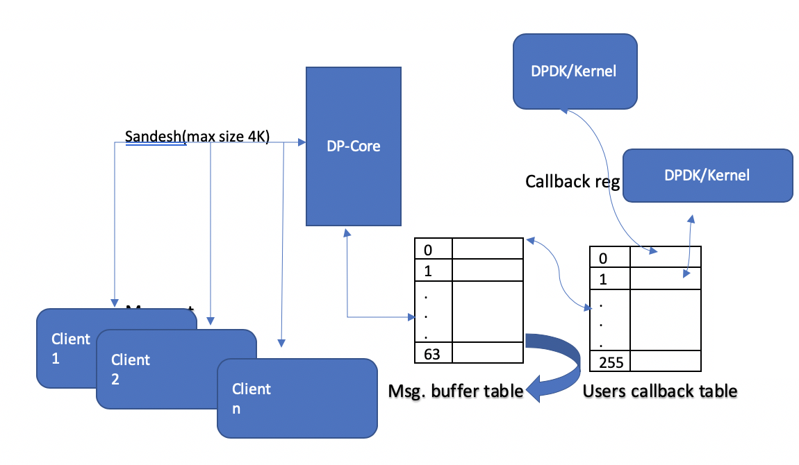

# 1. Introduction
This blue print describes the implementation of vrinfo framework which can work across DPDK and kernel to provide a way to dump internal structures of vRouter and send it via Sandesh.

In this document, we will discuss about the dpdkinfo tool which reads the internal data structures from vRouter and DPDK library and display on the console.

# 2. Problem statement
Currently, we dont have tools to dump the below information for DPDK
- Bond Info - Information displayed in linux as part of "/proc/net/bonding/bond0".
- LACP Info - LACP configuration, statistics etc.
- Mempool info - DPDK mbuf utilization for different mempools
- lcore to interface/queue info - Informatoin about lcore mapping to interfaces.
- NIC Info - Inforamtion about NIC tx/rx counters and errors.

# 3. Proposed solution

1. Need to develop a generic infrastructure which can work across DPDK and kernel to provide a way to dump internal state of the vrouter and send it to a CLI using sandesh messaging.

2. The sandesh limitation is 4KB. But the info that needs to be dumped can be more than 4KB. So this infra needs to have an ability to send it in chunks.

3. The infra should able to support multiple CLI clients in parallel.

4. The infra needs to provide an easy-to-use API interface for the users who needs to add more functionality.

   ## 3.2 Alternatives considered

   None

   ## 3.3 API schema changes

   Not Applicable

   ## 3.3 User workflow impact

   None

   ## 3.4 UI changes

   None

   ## 3.5 Notification impact

   None

# 4. Implementation
## 4.1 vrinfo Workflow Diagram



### Working Mechanism:

From above diagram, Client CLI request for a particular message from dp-core. For eg: Requetsting bond information. So, Dp-core will search that information in the registered users callback table and call corresponding function and retreive message and display on the console.

Users have to register thier callback function in vr_info.h file.

Sample Code:

```
#define VR_INFO_REG(X) \
			X(INFO_VER,  info_get_version, KERNEL) \
			X(INFO_BOND, info_get_bond,    DPDK) \
```

Callback API for DPDK should start with dpdk\_\<registered fn.name> and for kernel lh\_\<registered fn. name>. Eg: dpdk_info_get_bond & lh_info_get_version.

​    <u>From Client CLI – DPcore</u>:

​            A Client CLI(dpdkinfo) would be developed to query data from DPDK through Sandesh protocol. Once the request has been received by vrouter(dp-core), it will create an entry in Msg. buffer table. To support multiple CLI clients in parallel, we need to store in its corresponding index in msg. buffer table.

Assumption: Message buffer table size has fixed to 64 because vRouter(server) can able to process maximum of 64 clients in parallel.

​    <u>From DPCore – DPDK:</u>

​           Once the message received in dp-core, it will look into users callback table and call corresponding callback function with below arguments.

```
/* vr_info callback function arguments.
 * msg_req->inbuf      => vr_info provide some input to callback function(kind of filter).
 *              Eg: Incase for bondinfo, CLI wants to show a particular slave.
 * msg_req->inbuf_len  => Buffer length
 * msg_req->outbuf     => Callback function should allocate memory buffer and fill contents.
 * msg_req->outbuf_len => Callback function should provide Output buffer length.
 * msg_req->bufsz      => Optional: Send output buffer size from CLI
 * */
#define VR_INFO_ARGS vr_info_t *msg_req
```

  <u>From DPDK – DPCore:</u>

​           Vrinfo provides VI_PRINTF macro, so DPDK should use this macro to fill the message buffer contents which will get dispayed in CLI. Once the message has been completed, vRouter DPDK will return the message buffer pointer to vrouter(dp-core).

 <u>From DPCore – CLI:</u>

​            Sandesh has a limitation of sending only 4K size, so we have created a Message buffer table. So, If the message buffer size is more than 4K, vRouter(DP-core) will split the data and send it serially to Client CLI. Once all the message has been sent to Clinet, vRouter(Dp-core) will free the buffer.

### 4.1.1 Vrinfo sandesh message

Below sandesh message have been newly added to process the CLI requests.

```
buffer sandesh vr_info_req {
    1:  sandesh_op      h_op;
    2:  i16             vdu_rid;
    3:  i16             vdu_index;
    4:  i16             vdu_buff_table_id;
    5:  i16             vdu_marker;
    6:  i16             vdu_msginfo;
    7:  i32             vdu_outbufsz;
    8:  list <byte>     vdu_inbuf;
    9:  list <byte>     vdu_proc_info;
}
```

### 4.1.2 Newly added CLI

Dpdkinfo CLI has been added inside dpdk container to support the following commands.

```
Usage: dpdkinfo
                 --bond|-b                          Show Master/Slave bond information
                 --lacp|-l <conf/status/all>   Show LACP information from DPDK
                 --mempool|-m <all/<mempool-name>>  Show Mempool information
                 --stats|-n <eth>                   Show Stats information
                 --xstats|-n <all/<interface-id>>   Show Extended Stats information
                 --lcore                            Display lcore information
       Optional: --buffsz  <value>                  Send output buffer size
```

# 5. Performance and scaling impact

None

    ## 5.1 API and control plane
None

    ## 5.2 Forwarding performance
None

# 6. Upgrade
None

# 7. Deprecations
None

# 8. Dependencies
None

# 9. Testing
## 9.1 Unit tests
## 9.2 Dev tests
## 9.3 System tests

a. Bond

    1. Setup a system with bond interface and verify the output

    2. Setup a system without bond interface and check output should not get displayed and display only error message.

b. LACP

    1. Setup a system with bond and configure fast lacp timers and check output.
    2. Setup a system without bond and check for error message.
    3. Repeat the same for different cli arguments(conf/status/all)

c. Mempool

    1. Configure system with DPDK and check mempool information.

d. xstats

    1. Verify xstats output for different NIC cards(X710, 82599).

e. Stats

    1. Check packet stats output and verify against with vif output for bond and non-bond cases.

f. lcore

    1. Configure multiple lcores and verify the output.

# 10. Documentation Impact

# 11. References
