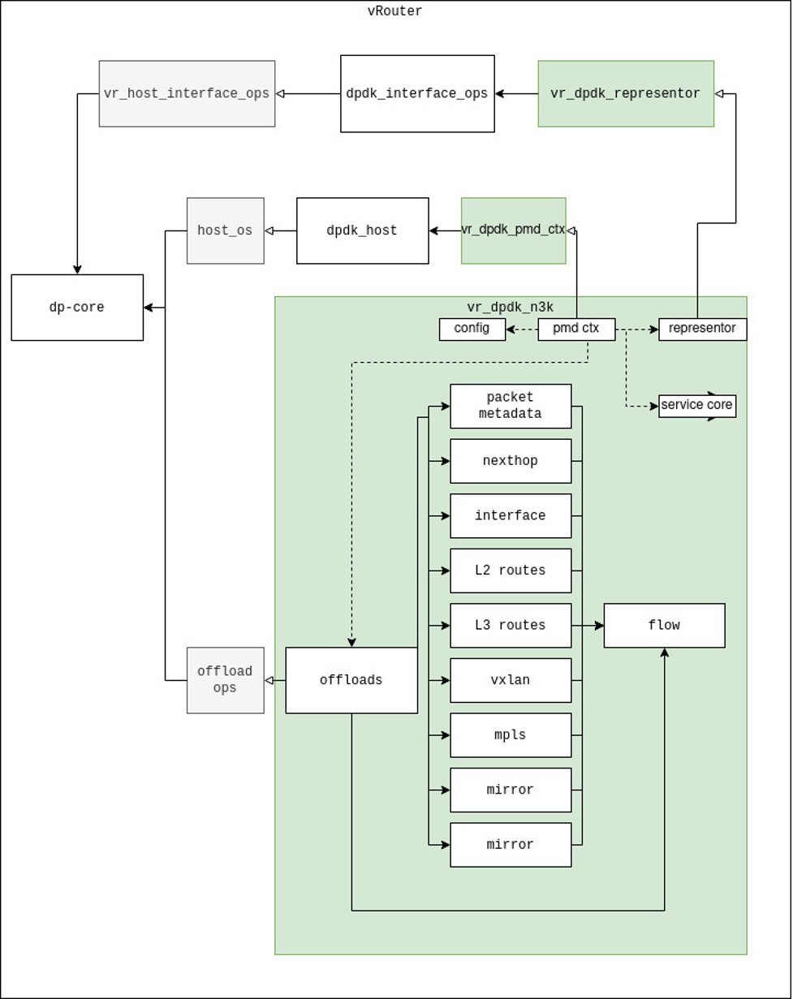

# 1. Introduction

-   This document describes an intention, vision, and details of the
    solution of the software components of TF vRouter-DPDK integration
    with Intel PAC N3000 board. It collects all important information
    and references to further documentation allowing proper
    understanding and usage of this functionality.

-   Blueprint/Feature Lead: Santosh Sethupathi ( <sethupathis@hcl.com> )
-   Core team:
    -   Kirubanandam Murthy( <kirubanandamm@hcl.com> )
    -   Anjanikumar Rai ( <anjanikumar.r@hcl.com> )
    -   Bharanidharan I ( <bharanidharan.i@hcl.com> )
 -   Jira Epic TT: <https://jira.tungsten.io/browse/TFF-20>

# 2. Problem statement

In the current vRouter-DPDK implementation, there is no support for
Intel PAC N3000 board which utilizes full hardware flow offload model.
Currently, there is a GOM (General Offload Module) API defined which
should be used to implement the vendor specific offload functionality
and some general GOM interface implementation which cannot be used for
Intel PAC N3000 full offload implementation.

Additionally, vRouter-DPDK has no interface for hardware flow offload
solutions based on specific DPDK PMDs, which have different logic for
physical and virtual vifs, require additional lcores and EAL
configuration not handled by vRouter's CLI. However we still want to use
vRouter-DPDK (dp-core) to make decisions on how to manage the traffic.
Intel PAC - NFVI vRouter Acceleration Solution, which uses N3K PMD, has
requirements that current vrouter-DPDK implementation does not satisfy.
These are:

-   additional lcores / service cores,
-   port representors for virtual and physical vifs,
-   offloading of only fully-established TCP sessions,
-   offloading of packet responsible for corresponding flow creation,
-   vDPA support.

# 3. Proposed solution

The main idea to add support for Intel PAC N3000 board to the
vRouter-DPDK is to implement an N3000-specific module that implements
vRouter's GOM API. The GOM module is responsible for:
-   Exposing the GOM API to vRouter-DPDK which will call the API when
    the offload information (nexthops, route/bridge tables, vifs, MPLS
    labels, mirrors and flows) are offloaded,
-   Extracting required information from offloaded data and saving it in
    internal cache,
-   using saved information to construct intermediate structure used for
    offloading when a specific flow is offloaded,
-   Translating the intermediate structure containing offload
    information into a corresponding rte_flow,
-   Programming the hardware flow table of Intel PAC N3000 board using
    DPDK's rte_flow API,
-   Deleting outdated flows from the hardware, reading offloaded flow
    statistics,
-   Managing the slow-path packets' metadata (parsed packet's headers
    data), which is required for creating reverse flows in full hardware
    offload mode.

All of the features of full flow offload of Intel PAC N3000 cannot be
provided by implementing only the GOM API. For requirements listed in
section 2, the following changes provided with Intel PAC - NFVI vRouter
Acceleration Solution are described:
-   PMD Context API:
    -   PMD Context is a new API introduced in vRouter-DPDK, which can
        be used to manipulate EAL initialization and allocate additional
        lcores.
    -   N3K PMD Context is used to handle N3K-specific CLI options,
        request additional lcores for DPDK service cores used by N3K PMD
        and initialize N3K GOM submodules if offload is enabled.
-   Representor API:
    -   Representor API is introduced in vRouter-DPDK to allow
        interconnection of DPDK interfaces with vRouter, where the
        interfaces have additional requirements on initialization logic,
        which vRouter-DPDK's vr_host_interface_ops implementation does
        not satisfy.
-   New packet parsing callbacks in GOM:
    -   New callbacks for offloading of slow-path packets were
        introduced to GOM, to parse the packet and get any information
        from it, which is not present in corresponding flow offload
        requests.
-   Offloading of fully-established TCP sessions:
    -   The non-fully established sessions are still offloaded.
        Additionally, a call to the flow offload GOM API has been added
        after the session is fully offloaded and should be handled
        properly by the offload implementation.

On the DPDK side, the N3000-specific PMD is required to handle the
N3000-specific rte_flow definitions, to initialize the hardware and to
expose VF representors to vRouter. The N3K PMD is delivered as a part of
the solution with the DPDK framework itself.

The detailed description of the features and logic implementation of the
N3K PMD and Intel PAC N3000 board integration with vRouter-DPDK can be
found in Intel PAC - NFVI vRouter Acceleration Solution Project - Design
Document.

Additionally changes in Tungsten Fabric TripleO Heat Templates will be
provided, allowing deployment and provisioning compute nodes supporting
Intel PAC N3000 in full offload mode.

## 3.1 Affected Modules

Data plane - vrouter / DPDK / SmartNIC - tf-vrouter

Deployment - tf-tripleo-heat-templates

## 3.2 Alternatives considered

N/A

## 3.3 API schema changes

N/A

## 3.4 User workflow impact

"enableN3K" option must be passed to vRouter's SConscript to compile and
link n3k-specific vRouter code. Without this option N3K PMD context will
not be registered.

"\--enable_n3k \<phy repr name\>" option, where "\<phy repr name\>" is
the name of the port representor of a N3K physical port, must be passed
via vRouter's CLI to start the PMD context, which enables N3K hardware
offload and n3k-specific vif handling. vRouter will fail to start if
this option is passed and N3K PMD context is not registered, or the port
representor name is invalid, or the N3K port representor cannot be
found.\
Additional DPDK EAL options can be passed using "\--eal \<name\>
\[\<value\>\]" option, where \<name\> is valid DPDK EAL option name, and
\<value\> is its value. vRouter will fail to start if this option is
passed and N3K PMD context is not registered or rte_eal_init returned an
error. It is used to start N3K vdev or to pass any EAL option not
handled by vRouter-specific options.\
Other options related to N3K PMD context:
-   \--no_drop_offload: Do not offload flows with action drop to N3K
-   \--aging_lcore: Enable N3000 aging lcore. Aging lcore is used to
    synchronize flow statistics information between N3K and vRouter
    Agent.
-   \--whitelist \<pci address\>\[,vdpa=1\]: Add pci address to a PCI
    whitelist. Add \`,vdpa=1\` after address to enable vDPA for
    specified N3K VF. Otherwise PCI passthru of VF to VM is expected.
    Equivalent to \`\--eal \--pci-whitelist\`.

An example of vRouter's CLI with N3K-based flow offload enabled is shown
below (specified in /etc/contrail/common_vrouter.env on vRouter host):

    DPDK_COMMAND_ADDITIONAL_ARGS=\--whitelist pci:\<mgmt PF\> \--whitelist pci:\<slowpath VF\> \--vdev net_n3k0,mgmt=\<mgmt PF\>,pf=\<slowpath VF\>,vfs=\[1,2,3\] \--enable_n3k \--offloads \--whitelist \<VFx\>,vdpa=1

Where:

-   \<mgmt PF\>: PCI address of N3K management PF

-   \<slowpath VF\>: PCI address of N3K slowpath VF

-   \<VFx\>: PCI address of N3K VF used in vDPA mode

-   vfs=\[1,2,3\]: List of VFs, for which port representors are created

TF TripleO Heat Templates must accommodate additional (optional)
parameters for ContrailDpdk profile (as described above vRouter-DPDK
must be run with specific arguments).

ContrailDpdkParameters:

-   ENABLE_SMARTNIC_N3000: bool, if TRUE the node will be provisioned
    with vRouter-DPDK with N3K-based flow offload enabled

-   ContrailSmartnicSriovNumVFs: number of VFs to be created on
    Smartnic. Used for ComputeDPDK only if "ENABLE_SMARTNIC_N3000" set
    to true

-   N3000_DRIVERS_PATHS: Location of Intel script containing necessary
    drivers and tools for Intel PAC N3000. Used for ComputeDPDK only if
    "ENABLE_SMARTNIC_N3000" set to true

Existing parameter "NIC_OFFLOAD_ENABLE" is used to enable full hardware
offload (e.g. enable offload API)

3.5 UI Changes

N/A

## 3.6 Operations and Notification impact

New log type for vRouter-DPDK - OFFLOAD_PACKET

OFFLOAD_PACKET is defined as user5 rte_log log type and is used in N3K
GOM implementation to log packet parsing related information. Can be
used by any DPDK-based GOM backend.

# 4. Implementation

## 4.1 Assignee(s)

-   Santosh Sethupathi ( <sethupathis@hcl.com> )

-   Kirubanandam Murthy( <kirubanandamm@hcl.com> )

-   Anjanikumar Rai ( <anjanikumar.r@hcl.com> )

-   Bharanidharan I ( <bharanidharan.i@hcl.com> )

## 4.2 Work items

Data plane - dp-core:
-   dp-core/vr_flow.c:
    -   Only fully established TCP traffic is offloaded on N3000.
        Additional offloads were required when TCP connection state
        changes,
    -   Flow statistics for offloaded flows are updated when they are
        read from the flow utility

Data plane - DPDK:
-   vRouter now prioritizes using 1GB hugepages, instead of 2MB sized if
    found.
-   SConscripts: Multiple changes has been introduced:
    -   Building DPDK on multiple cores: \`dpdk-jobs\`, a new scons
        option
    -   Building RPMs and images only for contrail-vrouter-dpdk: a new
        scons target \`contrail-compute\`)
    -   Additional option for conditional building vRouter with N3000
        support: described in 3.4.
    -   Additional unit tests support.

-   Introduction of PMD context API
    -   Defined in dpdk/vr_dpdk_pmd_ctx.h
    -   Used in dpdk/dpdk_vrouter.c in initialization logic. When no PMD
        contexts are registered, no changes to the initialization
        process are made.
    -   Backends register their PMD context implementations via
        vr_dpdk_pmd_ctx\_(de)register calls, called after/before
        vRouter-DPDK's main function.
-   Introduction of representor API
    -   Defined in dpdk/vr_dpdk_representor.h
    -   Used in vRouter-DPDK's implementation of vr_host_interface_ops
        (dpdk_interface_ops in dpdk/vr_dpdk_interface.c).
    -   Called on when vif add/delete requests are handled by vRouter.
        Status of addition/deletion is passed to vRouter-DPDK and
        indicates if the backend successfully handled a corresponding
        request or if default vif addition/deletion logic should be
        called.
    -   Backends register their representor API implementation via
        vr_dpdk_representor\_(de)register.

-   Packet parsing in GOM
    -   New callback voo_packet_parse is used, called in eth_rx and
        vm_rx, before vr_fabric_input and vr_virtual_input calls
        respectively.

-   N3000-specific GOM API implementation
    -   New hardware full offload module has been implemented.

-   TF TripleO Heat Templates
    -   Additional parameter added to ContrailDpdkParameters
        (environments/contrail/contrail-services.yaml)
    -   Support for additional parameters added, needed configurational
        steps on compute node implemented such as: Intel PAC N3000
        drivers installed, DPDK driver loaded and bound, VFs created
        (extraconfig/pre_network/contrail/contrail_dpdk_pre_network.yaml)

# 5. Performance and scaling impact

## 5.1 API and control plane

*Scaling and performance for API and control plane*

With N3000 Accelerated solution no impact on flow learning rate and the
scaling will be measured after the project delivery.

## 5.2 Forwarding performance

*Scaling and performance for API and forwarding*

No impact on forwarding performance is expected for non
N3000-accelerated vRouter installation.

Significant improvement on the performance for N3000 accelerated vRouter
in case of small packets and scaling will be measured after project
delivery.

# 6. Upgrade 

N/A

# 7. Deprecations

N/A

# 8. Dependencies

Intel PAC - NFVI vRouter Acceleration Solution's main dependencies are
vRouter-DPDK and vRouter GOM. No other feature is dependent on the
solution.

# 9. Testing

## 9.1 Unit tests

Unit tests are provided with N3000 offload implementation and located in
test/dpdk/n3k. These tests are related to vRouter GOM API
implementation, mostly to creation of rte_flow during vRouter flow
offload request for different types of traffic from intra-CN intra-vrf
local to MPLSoUDP L3 traffic.

## 9.2 Dev tests

Dev tests are provided with N3000 offload implementation and located in
test/dpdk/n3k. These tests, like unit tests, are related to vRouter GOM
API implementation, but require DPDK's EAL initialized to run.

## 9.3 System tests

Please refer to the Intel PAC - NFVI vRouter Acceleration Solution
Project - MPLS Test Plan document.

# 10. Documentation Impact

The features overview and usage should be documented as part of release
documentation. The Intel PAC - NFVI vRouter Acceleration Solution
Project Design Document is provided as the feature and implementation
details documentation.

# 11. References

-   Intel PAC - NFVI vRouter Acceleration Solution Project - Design
    Document - The feature and implementation details documentation.
-   Intel PAC - NFVI vRouter Acceleration Solution Project - MPLS Test
    Plan
-   [https://www.intel.com/content/www/us/en/programmable/products/boards_and_kits/dev-kits/altera/intel-fpga-pac-n3000/overview.html](https://www.intel.com/content/www/us/en/programmable/products/boards_and_kits/dev-kits/altera/intel-fpga-pac-n3000/overview.html)
