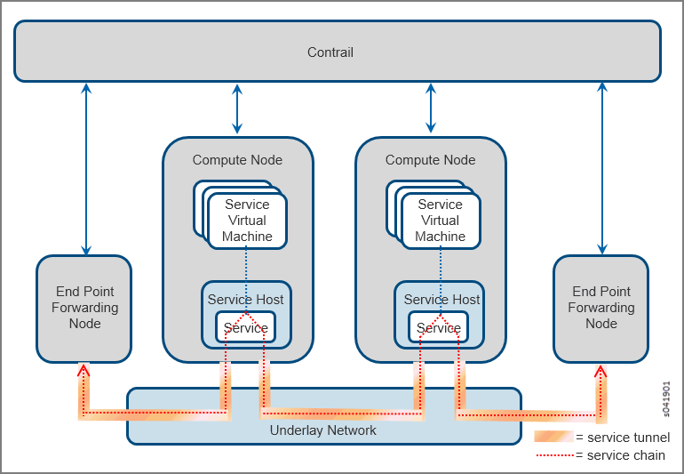
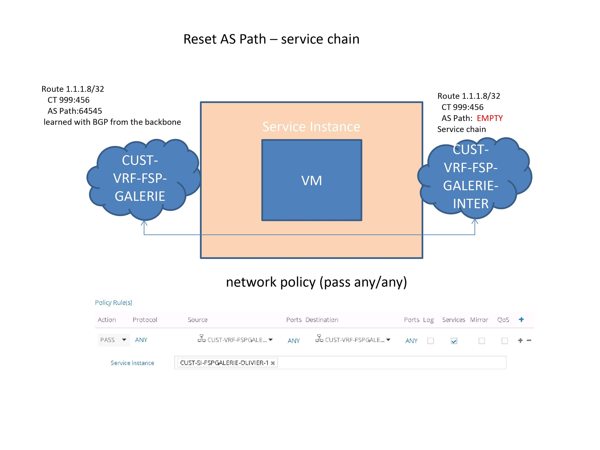
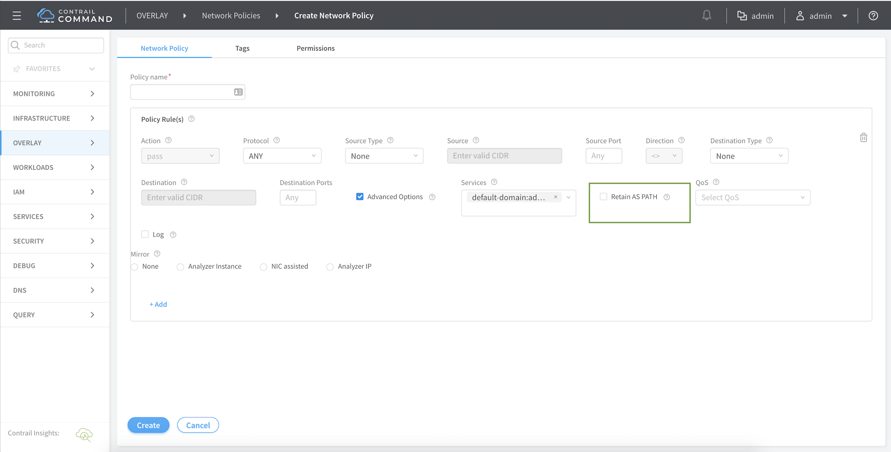

# 1.  **Introduction**

Contrail Controller supports chaining of various Layer 2 through Layer 7
services such as firewall, NAT, IDP, and so on. Services are offered by
instantiating service virtual machines to dynamically apply single or
multiple services to virtual machine (VM) traffic. It is also possible
to chain physical appliance-based services.

[Figure
1](https://www.juniper.net/documentation/en_US/contrail19/topics/task/configuration/service-chaining-vnc.html#service-chain-vm1)
shows the basic service chain schema, with a single service. The service
VM spawns the service, using the convention of left interface (left IF)
and right interface (right IF). Multiple services can also be chained
together.

Figure 1: Service Chaining{width="6.541666666666667in"
height="1.640625546806649in"}

When a user creates a service chain, the Contrail software creates
tunnels across the underlay network that span through all services in
the chain. [Figure
2](https://www.juniper.net/documentation/en_US/contrail19/topics/task/configuration/service-chaining-vnc.html#svc-chain)
shows two end points and two compute nodes, each with one service
instance and traffic going to and from one end point to the other.

Figure 2: Contrail Service Chain

{width="6.5in"
height="4.5in"}

The following are the modes of services that can be configured.

-   *Transparent or bridge mode*

    -   Used for services that do not modify the packet. Also known as
         bump-in-the-wire or Layer 2 mode. Examples include Layer 2
         firewall, IDP, and so on.

-   *In-network or routed mode*

    -   Provides a gateway service where packets are routed between the
         service instance interfaces. Examples include NAT, Layer 3
         firewall, load balancer, HTTP proxy, and so on.

-   *In-network-nat mode*

    -   Similar to in-network mode, however, return traffic does not
         need to be routed to the source network. In-network-nat mode
         is particularly useful for NAT service.

Service chaining requires the following configuration elements in the
solution:

*Service Template*

Service templates are always configured in the scope of a domain, and
the templates can be used on all projects within a domain. A template
can be used to launch multiple service instances in different projects
within a domain.

*Service Instance*

A service instance is always maintained within the scope of a project. A
service instance is launched using a specified service template from the
domain to which the project belongs.

*Service Policy*

This represents the network policy that links two virtual networks via a
service chain and is defined by a set of service instances that
comprises the service-chain.

# 2.  **Problem Statement**

Service-Chaining between a Source VN (SVN) and Destination VN (DVN)
works by re-originating interested DVN routes into the SVN using a
Service Instance Interface (SVI) as the next-hop. This causes traffic to
be steered through the service chain as desired. These service-chain
routes are classic inet\[6\] routes that get replicated into
bgp.l3vpn\[6\].0 table and then into remote inet\[6\] tables using the
bgp inet\[6\]-vpn address-family.

Today, when we set up a service chain between two virtual networks and
re-originate the interested DVN routes, we reset the AS Path attribute
of the service-chain routes. That is not the case for other BGP
attributes (such as community tags). See Figure 3 below for a visual
explanation where the AS Path attribute is removed in the re-originated
service-chain route.

**Figure 3: Problem Description**

{width="6.5in"
height="3.7656255468066493in"}

{width="6.5in"
height="4.276042213473316in"}

This is because PNF service chaining does not work if the PNF is
attached to an MX that\'s in a different AS than the contrail cluster.
The control-node does not send any re-originated routes to the MX even
though it does have those routes in it\'s own tables.

This happens because the re-originated service chain routes inherit the
AS path of the route for the service chain address. Since this route has
an AS Path that contains the MX AS, control-node figures that sending the
re-originated route would cause the MX to detect an AS Path loop and
hence, does not send the route. This was fixed by stripping the AS Path
of the re-originated routes.

This is expected and is default behavior. The customer here, however,
wants to have the flexibility to not follow the default behavior and
instead retain the AS Path attribute across the service chain.
Accordingly, the requirement is to provide a knob that will allow AS
Path to be maintained through a service chain.

# 3.  **Proposed Solution**

The solution to the problem is to provide a knob to control the reset of
AS Path attribute in the service-chain routes. There are two options
when it comes to the granularity at which a knob can be provided.

1.  At global level

    -  this will apply to re-originated paths in all service-chains

    -  simpler solution but generic and does not allow some
        service-chains to have a different behavior

2.  Knob per service-chain - this can be tuned to apply to a specific
    set of service-chains

    -  This is a bit more involved and will need changes in schema,
        config (schema-transformer), control-node and UI

    -  However, this will provide the ability to change the behavior at
        the granularity of a service-chain

Given that the second option gives more flexibility that can be achieved
at a relatively increase in complexity, we will go with it as the chosen
solution.

Having decided on the granularity of the knob, the next task is to
identify where in the schema the capability will be added. There are
three potential options here.

1.  Knob as part of the service-template configuration

    -  Having a knob in the service template will enable all service
         instances using this template to have this knob enabled

    -  This would mean that to have a service chain use this knob, we
         will need to have all the service instances in the
         service-chain to use a service template that has the knob
         enabled

2.  Knob as part of the service-instance configuration

    -  This will enable all service chains using the service-instance
        to enable the capability

    -  To achieve the end goal the user will have to configure the knob
        in all the service instances used by a service chain

3.  Knob as part of the network-policy configuration

    -  The above two cases would not work when two service chains share
         one or more service instances and each of those service chains
         need a different behavior with respect to the newly introduced
         knob. To overcome this, the user will have to configure
         separate service instances for the two service chains.

    -  Further, in the second solution, the user will need to configure
         the knob on all service instances used by the service chain
         needing the capability

    -  The third option allows the knob to be enabled at the
         granularity of a service-chain by providing the capability in
         the network policy that defines the service chain

Given the advantages of option 3, we will go ahead with this option and
allow the capability to be enabled as part of the network-policy
definition.

# 4.  **Implementation Details**

In order to implement the solution and provide a knob per service-chain,
changes are required to the following components and are described
below.

# a.  **Control-Node**

In order to allow communication between the VNs but require that traffic
between the VNs go through, for instance, a firewall, we will need to
create a service-chain by enabling a Service Instance (SI) (that hosts
the firewall) and directing all traffic between the VNs to traverse the
service chain as shown in Figure 10.

{width="6.5in"
height="6.010416666666667in"}

**Figure 4: Service Chain Implementation Details**

In this case, there is no link created between the VNs. Instead, as
shown in the Figure, in addition to the default RI, ST also creates one
or more Service-RIs (S-RIs) in each VN. The number of S-RIs in the VN
will correspond to the number of SIs in the service-chain. In the above
example, since we only have one SI (for enabling a firewall) in the
service-chain there will only be one S-RI (RIred' for VN-Red and
RIgreen' for VN-Green) created for each VN. To this S-RI, it also
attaches a Service Chain Info (SCI) property which contains a bunch of
information including the Source RI, Destination RI and the SI (next-hop
IP address of the Left IF) to be traversed among other things. The
purpose of the SCI is to enable control-nodes to re-originate all routes
from the Destination VN into the Source VN RI and steer traffic from the
Source VN to the Destination VN through the service-chain.

In the control-node, the following changes are required

1.  **Config handling for new knob**

The knob introduced in the network policy will translate into a
capability in the service routing-instances of a service chain in the
form of a bit in the service RIs created for the service chain.

With the introduction of the knob, we need changes in the config
handling module to handle the new information coming as part of the
service RIs and store it locally for each service chain.

2.  **Route re-origination module changes**

In order to provide the new capability, the service chain re-origination
module will be enhanced to not reset the AS Path attribute when
re-originating routes from the destination VN to the source VN. This
needs to be done for every service instance in the service-chain. If the
knob is not enabled, the module will retain the default behavior and
reset the AS Path attribute of the service chain routes. When the knob
is configured, the control-node will not reset the AS Path attribute
when re-originating a route from the destination VN to the source VN.

# b.  **Schema**

Schema changes are required at two levels

1.  **Network Policy**

A new knob will be introduced as part of the actions that can be taken
on a network policy defining a service chain to indicate the need to
retain the AS Path. Currently, the action allows a list of service
instances to be added representing the list of instances that will be
traversed when a packet is sent from the source VN to the destination
VN.

```
<xsd:complexType name="ServicePropertiesType">
    <xsd:element name="retain-as-path"
     type="xsd:boolean" default="false"
     required='optional'
     description='Indicates if as-path should be retained
     across service-instances in the service-chain'
</xsd:complexType>

<xsd:complexType name="ActionListType">
  <xsd:all>

...
    <xsd:element name="apply-service"
     type="xsd:string"
     maxOccurs="unbounded" required='optional'
    <xsd:element name="service-properties"
     type="ServicePropertiesType"
     required='optional'
     description='Properties of the service-
       policy if action is apply-service'>
  </xsd:all>
</xsd:complexType>
```

2.  **ServiceChainInfo**

As part of the service-chain-info defined for each service-instance, the
above knob will translate into a boolean to indicate to the control-node
whether the capability is enabled. This is the actual information that
is consumed by the control-node.

```
<xsd:complexType name="ServiceChainInfo">
  <xsd:all>

     ...

    <xsd:element name="retain-as-path"
     type = "xsd:boolean" default="false"

  <xsd:all>
</xsd:complexType>
```

# c.  **Config Node (Schema Transformer)**

Schema Transformer will retrieve retain\_as\_path from Policy rule
object and update it in the service-chain info so Controller can further
process the info.

From:

Service Name → Virtual Network → Network Policy → Policy Rule →
action\_list → **service-properties** → **retain\_as\_path**

To:

Service Name → Virtual Network → Routing Instance → Service Chain Info →
**retain\_as\_path**

Assumption**:** Since the retain\_as\_path attribute is available in a
Policy Rule, we are assuming that there will be only one policy-rule per
service per virtual-network. This is to ensure that retain\_as\_path
does not get overwritten by other policy-rules.

# d.  **UI (GUI, Provisioning, etc.)**

**1. '**Retain AS Path' should show up under Advanced Options only when
an input is provided in 'Services'.

{width="6.5in"
height="3.3055555555555554in"}

**2.** As defined in the network policy schema above, this property, if
set, should be sent as part of action-list under service-properties.

# 5.  **Upgrade**

# 6.  **Deprecations**

N/A

# 7.  **Dependencies**

N/A

# 8.  **Testing**

Unit-tests will be added for each module where changes are made. In
addition, feature tests will be done for integrating the different
modules.

# 9.  **Documentation Impact**

# 10. **References**
